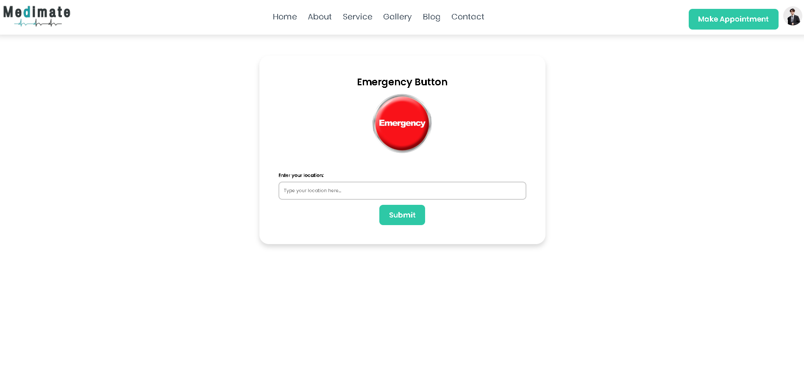
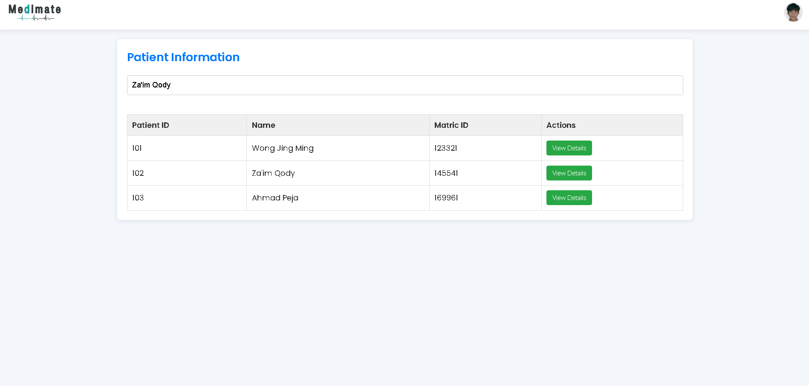

# 🏥 MediMate

**MediMate** is a web-based digital healthcare system developed to modernize **Pusat Sejahtera USM's** services. It replaces the traditional paper-based approach with an accessible digital platform, built entirely using **HTML**, **CSS**, and **JavaScript**, with **Firebase** for backend services like authentication and database storage.

This project supports **UN SDG 3: Good Health and Well-being**, promoting digital health services on campus.

---

## 🌟 Features

### 👩‍⚕️ Patient Side
- Login/Logout with Firebase Authentication
- View and edit personal information
- View medical records
- Request medical appointments
- Initiate and cancel emergency requests

### 🩺 Admin Side
- Admin login and dashboard
- View and manage patient appointments
- Publish medical records to patient profiles
- View patient information

---

## 🛠️ Tech Stack

- **Frontend**: HTML, CSS, JavaScript  
- **Backend Services**: Firebase (Authentication, Firestore)  
- **Hosting**: Can be deployed with Firebase Hosting / GitHub Pages

---

## 🚀 Getting Started

### Screenshots 


### Screenshots 





.png)



.png)
.png)


---

### Prerequisites

- Firebase account: [https://firebase.google.com](https://firebase.google.com)
- Web browser (Chrome recommended)
- Git (optional for cloning the repository)

### Installation

1. Clone this repository:

```bash
git clone https://github.com/yourusername/medimate.git
cd medimate
